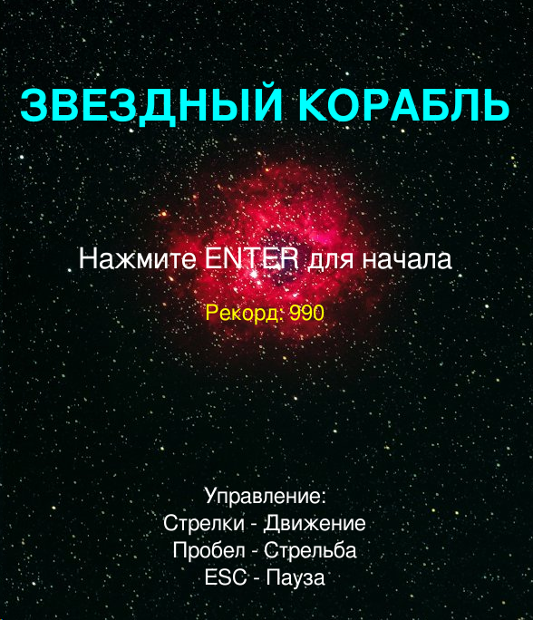
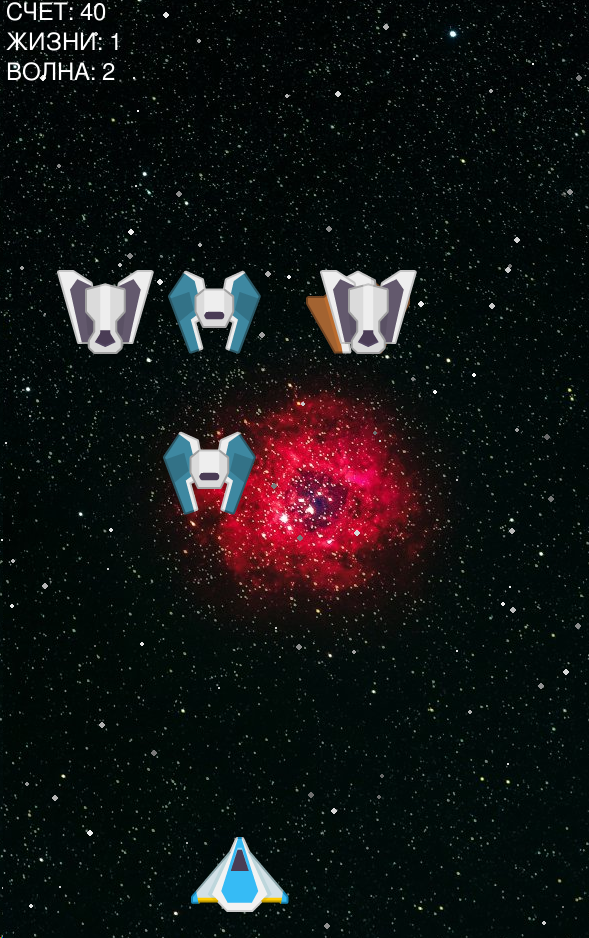
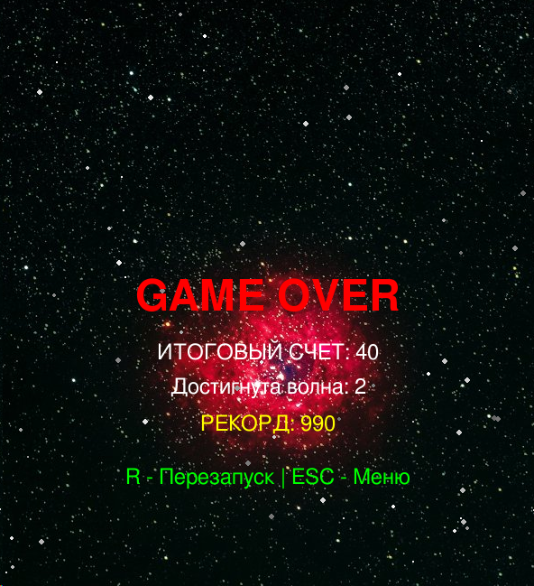

# 🚀 Звездный корабль (Star Ship)

Классический космический шутер на Python и Pygame. Управляйте космическим кораблем, уничтожайте врагов и набирайте очки!

## 📋 Требования

- Python 3.x
- Pygame

## 🔧 Установка

1. Установите Python 3.x (если не установлен)
2. Установите зависимости:
```bash
pip install -r requirements.txt
```

Или установите Pygame напрямую:
```bash
pip install pygame
```

## 🎮 Запуск игры

```bash
python game_main.py
```

## 🕹️ Управление

- **ENTER** - Начать игру (в главном меню)
- **Стрелки** (← ↑ → ↓) - Движение корабля
- **Пробел** - Стрельба лазером
- **ESC** - Пауза / Возврат в меню
- **R** - Перезапуск игры (после Game Over)

## 🎯 Геймплей

- Уничтожайте вражеские корабли, стреляя по ним лазерами
- Избегайте столкновений с врагами
- У вас есть **3 жизни**
- За каждого уничтоженного врага вы получаете **10 очков**
- После столкновения корабль становится неуязвимым на 2 секунды (мигает)
- **Система волн** - с каждой волной появляется больше врагов и они становятся быстрее
- Ваш лучший результат сохраняется автоматически
- Игра заканчивается когда закончатся все жизни

## 🎨 Особенности

### Визуальные эффекты
- **Параллакс фон** - движущиеся звезды создают эффект глубины
- **Система частиц** - красивые эффекты взрывов и выстрелов
- **Анимированные взрывы** - 5-кадровая анимация огня
- Плавное управление и физика движения
- Эффект мигания при неуязвимости

### Звук
- **Фоновая музыка** - атмосферное сопровождение
- Звуковые эффекты:
  - Выстрел лазера
  - Попадание по врагу
  - Потеря жизни

### Игровые системы
- **Главное меню** с отображением рекорда
- **Меню паузы** (ESC) с полупрозрачным оверлеем
- **Система волн** - прогрессивное усложнение игры
- **Сохранение рекорда** в файл highscore.json
- Система счета, жизней и волн
- Система неуязвимости после повреждения (2 секунды)
- Границы экрана - корабль не может вылететь за край

## 📁 Структура проекта

```
MAIN_TEMPLATE/
├── game_main.py              # Основной файл игры
├── ufo.py                    # Класс врагов
├── content_game/             # Игровые ресурсы
│   ├── Backgrounds/          # Фоны
│   ├── PNG/                  # Спрайты
│   │   ├── Enemies/         # Вражеские корабли
│   │   ├── Lasers/          # Лазеры
│   │   └── Effects/         # Эффекты
│   └── Bonus/               # Звуки и шрифты
└── README.md                # Этот файл
```

## 🎓 Обучающий проект

Этот проект отлично подходит для изучения:
- Основ Pygame
- Работы со спрайтами и коллизиями
- Игрового цикла (game loop)
- Управления состоянием игры
- Работы со звуком и графикой
- Событийно-ориентированного программирования

## 🛠️ Разработка

Для разработчиков: см. `CLAUDE.md` для детальной документации об архитектуре проекта.

## 📝 Лицензия

Графические и звуковые ресурсы: см. `content_game/license.txt`

## 🎉 Приятной игры!

Удачи в уничтожении вражеских кораблей! 🚀✨

  
